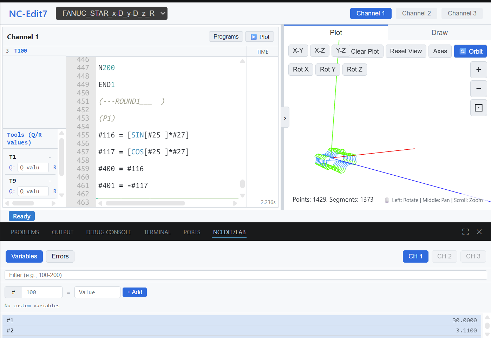

# NCEdit7Lab CNC Editor

A powerful, integrated **CNC editor for VS Code**, optimized for **FANUC turning machines** and modern NC workflows.  
With NCEdit7Lab you can **plot NC programs**, visually inspect toolpaths, and track **variable states**—all directly inside VS Code.



## Features
- **Integrated CNC Editor:** Fully integrated NCEdit7Lab CNC editor directly within VS Code—no external viewer required.
- **NC Plotting for FANUC Lathes:** Visualizes toolpaths, contours, and motion sequences for FANUC-based CNC turning machines.
- **Variable State View:** Displays system and user variable states during program interpretation.
- **Offline Ready:** Embedded Python backend ( NC plotting) for standalone processing—ideal for offline/enterprise environments.
- **Machine Support:** Initial implementation for selected CNC turning machines, designed to be extendable.

**Note:** This is the first beta version of NCEdit7Lab.  
Some features may still be incomplete or contain bugs.  
We appreciate any feedback that helps improve stability and functionality.

## How to use
*(TODO: Add detailed instructions, e.g.: open a `.nc` file, click the NCEdit7Lab icon in the side bar, or run the command “NCEdit7Lab: Start” from the Command Palette.)*

## Contact & Links
- **Feedback:** For improvements, unsupported NC Codes, or missing file extensions, please send an email 
to <damian.roth@d-creations.org> or reach out on [Instagram @d_creations91](https://www.instagram.com/d_creations91).
- **Web Version:** Try the [web version of ncedit7lab](https://ncedit7lab.d-creations.org/).

---

<details>
<summary>Development & Build Instructions</summary>

This project requires compiling the TypeScript extension, downloading the portable embedded Python runtime, grabbing frontend UI assets, and aggregating licenses.

To completely build and aggregate all dependencies into the final bundle folder:
```sh
npm install
npm run bundle
```

This command will sequentially:
1. `setup:python`: Download and extract embedded Python (3.11).
2. `generate:licenses`: Extract dependency licenses for Node and Python, generating the `ThirdPartyNotices.txt` file.
3. Pull in required UI assets to the distribution bundle.

### Packaging
To generate the final `.vsix` package for publishing:
```sh
vsce package
```


## License
Provided under the MIT License. See the [LICENSE](LICENSE) file for details. 

**Third-Party Notices:** This extension bundles third-party software (including Python and various libraries). Please see [ThirdPartyNotices.txt](ThirdPartyNotices.txt) for the full list of licenses and notices.
This extension bundles open-source software. All third-party software license information is aggregated during the build process and distributed within the extension package inside [ThirdPartyNotices.txt](ThirdPartyNotices.txt).
</details>
